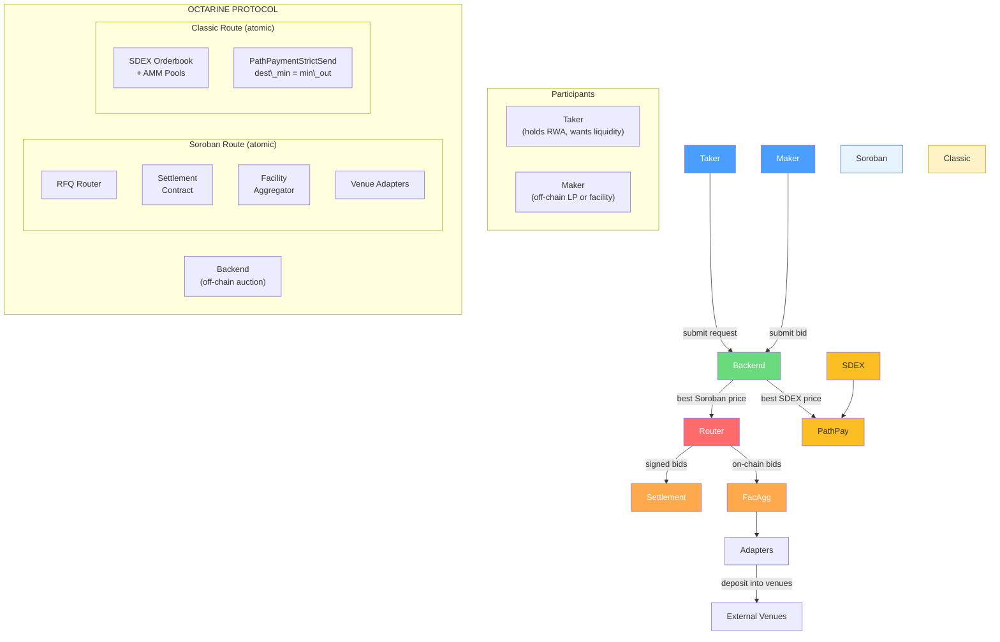
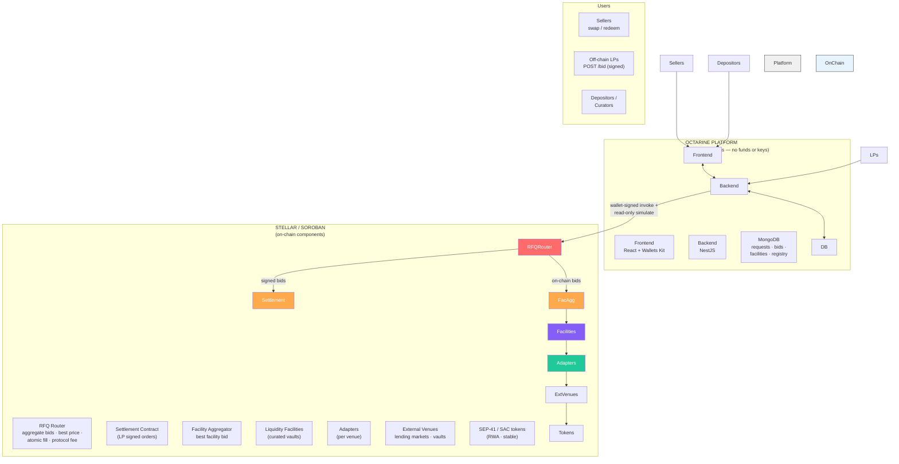
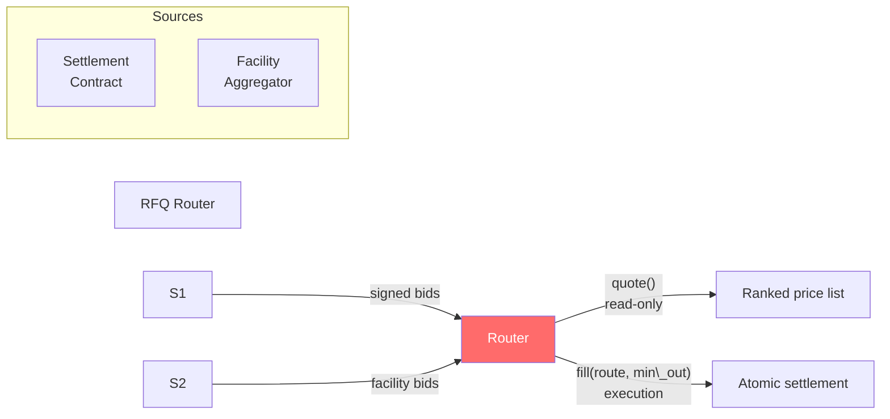
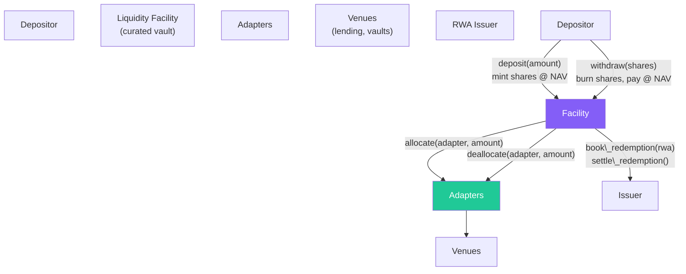
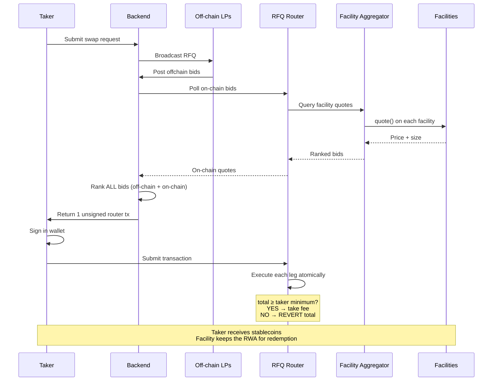
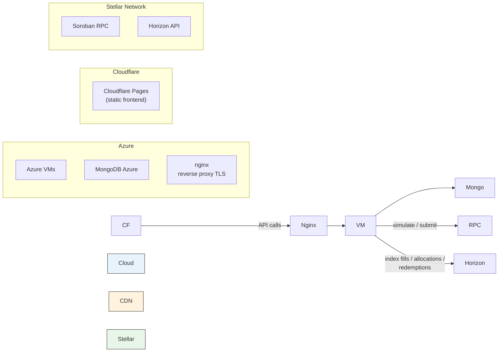
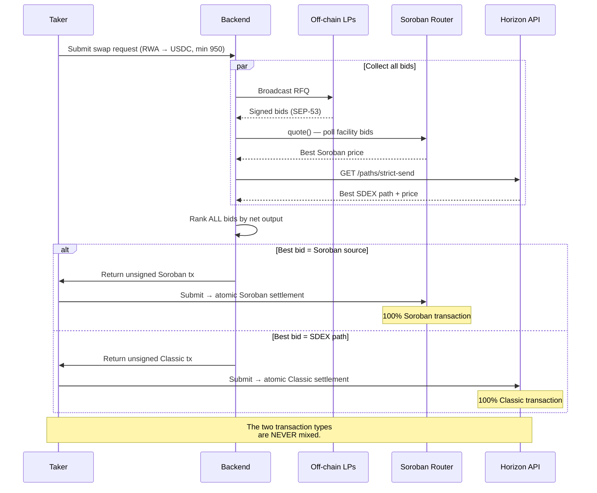
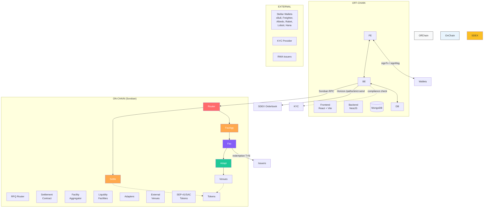

# Octarine
## Technical Architecture — Production Build on Stellar

---

# 1. Introduction

## 1.1 High-Level Overview

Octarine is a protocol enabling instant liquidity for RWAs, by auctioning liquidations with institutional LPs and curated liquidity facilities.

RWAs struggle to get DEX liquidity because they're fragmented, regulated and tend to have built-in redemption times. These are not instant, however, which means that RWAs can't be onboarded in lending, as DeFi liquidations need instant liquidity. It also doesn't allow for managing leveraged loops, as users can't instantly unwind their positions. To top it all off, the absence of instant liquidity makes RWAs less attractive for prospective LPs, who can't afford to have their capital locked up unwillingly. This ultimately means that RWAs can have no utility in DeFi nor any functional secondary markets until instant liquidity is solved, as they can't be traded or otherwise onboarded as collateral.

Octarine changes that, by giving liquidity to RWAs via auctions with LPs and curated liquidity facilities. When there is a liquidation, either on Octarine or on a connected venue, Octarine detects it and auctions it with connected bidders. We then award the trade to the best bid available. Bidders on Octarine can at any time create and curate vaults with their bidding strategy, thus making the trade accessible to a broader audience. These vaults keep user deposits in lending strategies and call them when they win a liquidation to send to the user. In return, they then receive and redeem the RWA whilst earning a haircut in the process.

The protocol is thus comprised of several elements, namely:
- A settlement contract, which settles transactions between the auction winner and the user. Supports both swaps and lending market liquidations.
- A backend, which handles and coordinates the auction logic and aggregates bids from both off-chain and on-chain sources and chooses the best price. The backend is connected to an API/SDK, such that third-parties can easily bid on the RFQ and integrate with us to enable instant liquidity on their assets.
- A liquidity facility contract, which enables bidders to curate vaults that keep user deposits in lending markets and bid on liquidations with lending TVL;
- Adapter contracts for each protocol that we integrate with. For example, each lending market connected to a facility will need its own adapter contract.
- An RFQ router contract, which considers both off-chain bids and on-chain pricing sources to ascertain the best bid and settle the trade with it.
- A facility aggregator contract, which aggregates pricing from all liquidity facilities.

Serves this document to outline the architecture that Octarine is implementing to have this protocol on Stellar. In addition to the architecture design for the whole build, this repo has the codebase of a bare-bones settlement contract on Stellar that our team has already made, the first and most crucial piece of the above 5 that make up the full planned build of Octarine on Stellar.

How this settlement contract works is simple: a user submits a swap request, the platform runs a short auction amongst connected bidders and then gives the trade to the winning bid. The trade is then settled in a single atomic transaction, exchanging each party’s assets with one another whilst taking a protocol fee. This is live on Stellar Testnet already, deployed with the contract CAPVBMQBVQVDFDWFGH4M3EJH7CYM7MWIYE5TOYTYASOU26L2Q4T2YJZW. Let us now look into the architecture of the whole protocol in more detail, the settlement contract included.


## 1.2 Definitions, acronyms and abbreviations

- **RFQ** – Request-for-Quote: an auction sale of an asset where entities bid on either via a signed quote (off-chain LP) or a live on-chain quote (facility / DeFi
  source).
- **Maker** – The party bidding and providing liquidity (e.g. the LP paying stablecoin for an RWA). May be an off-chain signer or an on-chain source.
- **Taker** – The party creating the auction and accepting the bid, aka filling the order on-chain. Also called the **seller**.
- **PMM** – Private Market Maker: an institutional LP that bids off-chain on the RFQ with their own balance sheet.
- **RFQ Router** – The on-chain contract that aggregates every bid source, picks the bid with the
  best price, and settles the winning route atomically.
- **Facility aggregator** – The on-chain component that collects and ranks bids
  across all curated liquidity facilities and routes the winning facility's fill.
- **Facility** – A curated, share-based vault that keeps
  depositor funds in yield strategies and bids on the RFQ with that TVL.
- **Curator** – The party that creates and curates a facility and runs the  strategy.
- **Venue** – An external Stellar DeFi protocol that a facility deploys capital into
  (e.g. a lending market or a vaults product).
- **Adapter** – A thin contract giving a facility a uniform interface over one
  external venue, so capital can be deployed and pulled without venue-specific code.
- **Haircut** – The discount a bidder asks for to provide instant liquidity.
- **NAV / share** – Net Asset Value of a facility and the unit of depositor
  ownership; share price = NAV / shares outstanding.
- **Base assets** – The assets a facility deposits and pays out in
  (typically a stablecoin, e.g. USDC).
- **Liquidation** – Forced sale of RWA collateral on a connected lending venue when
  a position becomes unhealthy; a primary source of RFQ flow.
- **Soroban** – Stellar's smart contract platform.
- **SEP-41** – Stellar's standard token interface (`approve`, `transfer_from`,
  `balance`).
- **SEP-53** – Stellar's message-signing standard; the analogue of EVM's EIP-712.
- **SAC** – Stellar Asset Contract: the Soroban wrapper exposing a classic Stellar
  asset through the SEP-41 token interface.
- **strkey** – Stellar's address encoding (`G…` accounts, `C…` contracts).
- **Allowance** – Permission to spend a token up to an amount (carries an
  `expiration_ledger`).
- **Fee recipient** – The address that receives the protocol fee.
- **XDR** – Stellar's canonical binary serialization (used for order hashing).
- **Soroban RPC** – The JSON-RPC endpoint for simulating and submitting Soroban
  transactions.

---

# 2. Architecture Overview & Constraints

## 2.1 The protocol at a glance

Octarine conducts **off-chain auctions with on-chain settlement**. The
backend never holds keys or funds, rather it coordinates the auction and gives the
trade to the winning bidder for on-chain settlement.

Two sources of liquidity compete on every trade:

| Liquidity source | How it bids | How it settles |
|---|---|---|
| **Off-chain LP** | `POST /bid` with a SEP-53-signed maker order | Settlement contract `fill_*` (signed maker leg) |
| **Curated facility** | On-chain `quote` from facility aggregator | Router swaps using facility liquidity |

The backend fetches and ranks prices from both, the bid with the **best price** wins, and the **RFQ router**
settles the winning route in one atomic transaction.

## 2.2 High-Level Architecture

```
        Taker                                           Maker
   holds an RWA,                               (off-chain LP, facility)
wants instant liquidity                 quotes a price for providing instant liquidity
            │                                               │  
            │  submits request                              |  submits bid
            |                                               │
            ▼                                               ▼
   ╔═══════════════════════════════════════════════════════════════════════════╗
   ║                          OCTARINE  PROTOCOL                               ║
   ║   Off-chain auction with on-chain atomic settlement for RWA liquidity.    ║
   ╚══╤═════════════════╤═════════════════╤═════════════════╤══════════════════╝
      │                 │                 │                 │
      │ curation of     │ aggregation     │ settlement      │ routing
      │ facilities      │ of on-chain bids|                 │ 
      ▼                 ▼                 ▼                 ▼
   Facility         Aggregator           Settlement        Router
   Contracts        Contracts           Contracts       Countracts   
      │                 
      │ deposit into                                        
      | venues          
      ▼                                           
  Venue Adapter                                            
   Contracts         
```

## 2.3 Zoom into the Octarine System (Component diagram)

The off-chain backend runs the auction and hands the taker wallet-signable
operations; the on-chain contracts settle the winning route. On-chain, the **RFQ
Router** is the single front door: it draws bids from the **Settlement contract** (off-chain LP signed orders), and the **Facility Aggregator** (curated vault bids),
picks the bid with the best price, and settles atomically. Facilities deposit into venues for yield through **Adapters**.

```
   Sellers                Off-chain LPs               Depositors / Curators
   swap / redeem          POST /bid (signed)          deposit · curate
        │                       │                            │
        └───────────────┬───────┴──────────────┬─────────────┘
                        ▼                      ▼
  ╔════════════════════════════════════════════════════════════════════════════╗
  ║  OCTARINE PLATFORM   (off-chain, keyless — holds no funds and no keys)     ║
  ║                                                                            ║
  ║  ┌────────────────┐   ┌───────────────────────────┐    ┌────────────────┐  ║
  ║  │ Frontend       │──▶│ Backend (NestJS)           │──▶│ MongoDB        │  ║
  ║  │ React + Wallets│◀──│ auction · bid intake ·     │◀──│ requests·bids· │  ║
  ║  │ Kit            │   │ quote aggregation ·        │   │ facilities·    │  ║
  ║  └────────────────┘   │ keyless op assembly ·      │   │ registry       │  ║
  ║                       │ API/SDK · keepers          │   └────────────────┘  ║
  ║                       └─────────────┬──────────────┘                       ║
  ╚═════════════════════════════════════╪══════════════════════════════════════╝
                                         │  wallet-signed invoke + read-only simulate
                                         ▼
  ╔═══════════════════════════════════════════════════════════════════════════╗
  ║  STELLAR / SOROBAN   (the on-chain components)                            ║
  ║                                                                           ║
  ║                    ┌────────────────────────────────┐                     ║
  ║                    │           RFQ Router           │                     ║
  ║                    │  aggregate bids · best price · │                     ║
  ║                    │  atomic fill · protocol fee    │                     ║
  ║                    └──┬───────────────┬──────────┬──┘                     ║
  ║        signed bids    │                          │   on-chain bids        ║
  ║      ┌────────────────┘                          └────────┐               ║
  ║      ▼                                                    ▼               ║
  ║ ┌──────────────┐                             ┌────────────────────────┐   ║
  ║ │ Settlement   │                             │ Facility Aggregator    │   ║
  ║ │ Contract     │                             │ best facility bid      │   ║
  ║ │ (LP signed   │                             └───────────┬────────────┘   ║
  ║ │  orders)     │                                         │                ║
  ║ └──────┬───────┘                                         ▼                ║
  ║        │                                     ┌────────────────────────┐   ║
  ║        │                                     │ Liquidity Facilities   │   ║
  ║        │                                     │ (curated vaults)       │   ║
  ║        │                                     └───────────┬────────────┘   ║
  ║        │                                                 │                ║
  ║        │                                                 ▼                ║
  ║        │                                     ┌────────────────────────┐   ║
  ║        │                                     │ Adapters (per venue)   │   ║
  ║        │                                     └───────────┬────────────┘   ║
  ║        │                                                 ▼                ║
  ║        │                                     ┌────────────────────────┐   ║
  ║        │                                     │ External venues        │   ║
  ║        ▼                                     │ lending markets·vaults │   ║
  ║ ┌──────────────────────────────────┐         │ (yield + redemption)   │   ║
  ║ │ SEP-41 / SAC tokens (RWA·stable) │◀────────┤                        │   ║
  ║ └──────────────────────────────────┘         └────────────────────────┘   ║
  ╚═══════════════════════════════════════════════════════════════════════════╝
```

The on-chain components are the Soroban contracts (router, settlement, aggregator, facilities and adapters) plus the SEP-41/SAC tokens they move.

## 2.4 Architecture constraints

- **Non-custodial backend** — every value-changing action is signed by
  a wallet (taker, LP, depositor) or authorised by a contract. The backend holds no keys and no funds.
- **Atomic settlement** — all legs of a fill (token swap, protocol fee, and any
  venue liquidity pull) move in one transaction or the whole fill reverts. No
  partial settlement state, including across blended multi-source routes.
- **Best-price execution** — the router selects the best bid (or blend
  of bids) and enforces a taker-specified minimum output; the fill reverts if the
  taker were to receive less than quoted.
- **Many bid channels, one auction** — off-chain signed orders, and
  facility bids are ranked together; all settle through the same atomic transaction.
- **Signatures produced by wallets** — maker orders must be signable
  by both browser wallets (xBull/Freighter) and bot wallets using the same scheme
  (SEP-53). Contract sources (facilities) bid via on-chain quotes, not
  signatures.
- **Replay safety** — signatures are bound to a specific deployment (domain
  separation) and network (SEP-53 passphrase).
- **Token model** — assets follow **SEP-41**, allowances are explicit and expire. 
  Regulated RWAs may additionally enforce transfer authorization at the token level.
- **Curated facilities** — facilities act only within their
  curator-set policy; they never take discretionary action outside it.
- **Modular venue integration** — facilities reach external venues only through
  adapters implementing a fixed interface; adding a protocol means adding an
  adapter, not changing core contracts.
- **Networks** — Stellar **testnet** and **mainnet** only; all deployments via
  `stellar-cli`.


# 3. Contract Overview

The protocol's on-chain logic is split across the Soroban contracts below.

## 3.1 Settlement Contract

A Soroban contract that settles maker-signed orders between two SEP-41 tokens. It
verifies the maker's signature, computes the proportional fill, atomically swaps
the two legs via `transfer_from`, and skims the protocol fee from the maker's
output. It is the settlement core for off-chain (LP / PMM) bids, and the
signed-bids leg beneath the router.

**Key Functions:**

- **SAC allowance** → makers and takers must grant the contract a SEP-41/SAC
  allowance before it can pull funds from their wallets; custody never leaves the
  wallet and the backend holds no keys.
- **Fill (`fill_rfq_order` / `fill_limit_order`)** → the taker submits a
  maker-signed order; the contract checks the order is still fillable, verifies the
  SEP-53 signature, clamps the fill to the remaining amount, and settles.
  `fill_or_kill_*` variants require an exact fill or revert.
- **Settlement math** → `taker_filled = min(fill, taker_amount − filled)`;
  `maker_filled = floor(taker_filled × maker_amount / taker_amount)`;
  `fee = floor(maker_filled × token_fee_amount / maker_amount)` (256-bit
  intermediates avoid `i128` overflow). Taker receives `maker_filled - fee`.
- **Signature verification (SEP-53)** → the maker signs the order hash as a SEP-53
  message; the contract recomputes `SHA256("Stellar Signed Message:\n" ‖
  order_hash)` and `ed25519_verify`s it. A maker signing its own order needs no
  registration (its ed25519 key is recovered from its `G…` address); delegated hot
  keys are authorised via `register_order_signer`.
- **Cancellation** → `cancel_{rfq,limit}_order` (single) and `cancel_pair_*`
  (invalidate all of a maker's orders for a pair below a salt).
- **Fees** → limit orders carry `token_fee_amount` → `fee_recipient`;.
- **Admin** → `initialize(admin)` and native `upgrade(wasm_hash)`.

## 3.2 RFQ Router

A Soroban contract that aggregates every bid source for a request, selects the best
execution, and settles the winning route atomically against a taker minimum output. It routes through the settlement contract for off-chain bids and the
facility aggregator when facilities have the best prices. In addition, a trade can settle against a single source or a blend of multiple.

**Key Functions:**

- **Quote aggregation (`quote`)** → polls each aggregator for a price (on-chain bid)
  at the trade size and returns the list; read-only, used by the backend
  to get on-chain bids for the auction.
- **Route & fill (`fill`)** → the taker submits the chosen route;
  the router executes each leg, sums the taker's realised output, and asserts it
  meets `min_out`, reverting the whole transaction otherwise.
- **Source registry (`register_source`)** → governance whitelists the settlement
  contract, and facility aggregator as routable sources.
- **Atomicity & fees** → every leg settles in one transaction; signed legs inherit
  the settlement contract's submission gating with the router as the authorised
  origin, and a protocol fee is skimmed from the settled output.
- **Admin** → `initialize(admin, fee_recipient, fee)` and native `upgrade(wasm_hash)`.


## 3.3 Facility Aggregator

A Soroban contract that collects and ranks quotes across all curated facilities for a
requested RWA and settles the winning facility's fill. It is the single integration
point the router sees for all facilities.

**Key Functions:**

- **Facility registry (`register_facility`)** → curators register a facility and the
  assets it serves; governance can pause or revoke it.
- **Quote (`quote`)** → polls each eligible facility's bid price for the RWA and
  size and returns the ranked set; read-only.
- **Route & fill (`fill`)** → forwards the winning facility's fill request under the
  router's call.


## 3.4 Liquidity Facility

A Soroban contract implementing a curated, share-based vault that keeps depositor
funds in yield venues and bids on the RFQ with that TVL. On winning, it pulls
liquidity from its venues, pays the taker, takes the RWA, and later redeems it for
a haircut that accrues to share value net of a curator fee.

**Key Functions:**

- **Deposit / withdraw (`deposit` / `withdraw`)** → depositors mint shares at the
  current NAV and burn them to redeem for stablecoins; withdrawals are served up to
  free liquidity and otherwise queued until redemptions settle.
- **NAV & shares** → `NAV = idle_base + venue_balances (incl. accrued yield) +
  acquired_RWA (held at cost)`; `share_price = NAV / shares`.
- **Bid (`quote`)** → returns the facility's price for an RWA redemption for a given amount within
  its curator-set caps.
- **Redeem assets for stablecoins (`redeem_for_assets`)** → called by the aggregator on a win:
  validates price and caps, pulls just enough stablecoins from venues via adapters, pays
  the seller, takes the RWA, and books it for redemption, inside the
  router's atomic fill.
- **Venue allocation (`allocate` / `deallocate`)** → idle stablecoins are deployed to
  whitelisted venues and pulled on demand, bounded by each adapter's
  withdrawable balance.
- **Redemption (`book_redemption` / `settle_redemption`)** → acquired RWA is redeemed
  with the issuer (T+N).

## 3.5 Adapters

Thin Soroban contracts that give each facility a uniform interface over one external
venue, so assets can be deployed and pulled. Adding a
protocol to the ecosystem means writing and whitelisting one adapter, never
touching the facility, aggregator, or router code.

**Key Functions:**

- **Deposit / withdraw (`deposit` / `withdraw`)** → move the stablecoins between the
  facility and the venue, returning the actual amount moved.
- **Balances (`total_assets` / `max_withdraw`)** → report the facility's current
  redeemable balance (including accrued yield) and how much can be withdrawn
  instantly; the latter bounds how much a facility can safely bid.
- **Scope** → two adapters ship first: a lending market and a vaults product;

---

# 4. Protocol Flows

The flows below walk through the protocol end to end. Throughout, the **taker** is
the party holding an RWA who wants instant liquidity (the seller), and a **bid** is
an offer to buy that RWA for stablecoin. The backend runs every auction off-chain
but never holds keys or funds — it only hands the taker a transaction to sign, and
the RFQ router settles it on-chain.

## 4.1 An off-chain LP wins a swap

This is the simplest case: an institutional LP gives the best bid.

```
┌───────────────────────────────────┐
│ Taker  (holds RWA, wants stables)  │
└─────────────────┬─────────────────┘
                  │ submit swap request
                  ▼
┌───────────────────────────────────┐
│ Backend — runs the auction        │ ◀──── LPs sign & post their bids
└─────────────────┬─────────────────┘
                  │ returns the best bid as an unsigned transaction
                  ▼
┌───────────────────────────────────┐
│ Taker — signs in wallet & submits  │
└─────────────────┬─────────────────┘
                  │ one atomic transaction
                  ▼
┌───────────────────────────────────┐
│ RFQ Router  →  Settlement Contract │
│   RWA        :  taker → LP         │
│   stablecoin :  LP → taker (− fee) │
└───────────────────────────────────┘
```

## 4.2 A curated facility wins (or a blended route)

Facilities bid on-chain, so the backend reads their prices through the router and
ranks them against the off-chain LP bids in the same auction.

```
┌───────────────────────────────────┐
│ Taker                             │
└─────────────────┬─────────────────┘
                  │ submit swap request
                  ▼
┌───────────────────────────────────┐  poll on-chain bids
│ Backend — runs the auction        │ ──────────────────▶ RFQ Router → Aggregator → facilities
│                                   │                     
│                                   │ ◀──── LPs post offchain bids
└─────────────────┬─────────────────┘
                  │ ranks every bid → best single source or a blend,
                  │ returned as one unsigned router transaction
                  ▼
┌───────────────────────────────────┐
│ Taker — signs in wallet & submits │
└─────────────────┬─────────────────┘
                  │ router settles every leg in one atomic tx
                  ▼
┌───────────────────────────────────┐
│ RFQ Router                        │
│   facility leg → Facility Agg     │  pull venue liquidity from facility → pay taker → give RWA to facility
│                  → Facility       │
└─────────────────┬─────────────────┘
                  │ total ≥ taker minimum?  take fee  :  REVERT
                  ▼
┌───────────────────────────────────┐
│ Taker gets stablecoin;            │
│ facility keeps the RWA to redeem  │ 
└───────────────────────────────────┘
```

## 4.3 Depositing into and withdrawing from a facility

**Depositing:**

```
┌───────────┐  approve + sign deposit  ┌──────────────────────────┐  deploy stables      ┌────────────────────┐
│ Depositor │ ───────────────────────▶ │ Facility — mints shares  │ ──────────────────▶ │ Adapters → venues  │
└───────────┘                          │ at the current NAV/share │                      │ (earn yield)       │
                                       └──────────────────────────┘                      └───────────────_────┘
```


**Withdrawing:**

```
┌───────────┐  sign withdrawal    ┌──────────────────────────┐  pull liquidity if needed  ┌────────────────────┐
│ Depositor │ ─────────────────▶ │ Facility — burns shares,  │ ─────────────────────────▶ │ Adapters → venues  │
│           │ ◀───────────── ─── │ pays stablecoins at NAV   │ ◀───────────────────────── │                    │
└───────────┘   stablecoins out   └──────────────────────────┘                            └────────────────────┘
        
```


## 4.4 The redemption lifecycle

This is how a facility turns a won RWA back into stablecoin and profit.

```
┌──────────────────┐  sends RWA       ┌────────────────────────┐  redeem with issuer (T+N)  ┌──────────┐
│ RFQ Router       │ ───────────────▶ │ Facility               │ ─────────────────────────▶│ Issuer   │
└──────────────────┘                  └───────────┬────────────┘                            └────┬─────┘
                                                  ▲                                              │
                                                  │                                              │
                                                  └────────────settles stablecoins───────────────┘
```

## 4.5 A lending market liquidation

This is the core utility unlock: a lending market can safely accept RWA collateral
because Octarine guarantees an instant buyer the moment a position is liquidated.

```
┌─────────────────┐  position unhealthy  ┌──────────────────────────┐                    ┌───────────────────────────── ───┐
│ Lending market  │ ───────────────────▶ │ Octarine bots detects it │ ────────────────▶ │ Backend : starts an RFQ auction │
└─────────────────┘                      └──────────────────────────┘                    └─────────┬─────────────────── ───┘
                                                                                                   │ best bid wins
                                                                                                   ▼
                                   ┌─────────────────┐  stablecoins sent to lending market  ┌───────────────────┐  
                                   │ Loan repaid     │ ◀─────────────────────────────────── │ RFQ Router        │ 
                                   │ to the market   │ ───────────────────────────────────▶ │ settles the trade │         
                                   └─────────────────┘  Collateral sent to RFQ router       └───────────────────┘  
```

---

# 5. Technology Stack & Infrastructure

## 5.1 Smart contracts (Soroban)

- **Settlement contract** — RFQ + limit order settlement;
  SEP-53 signatures, SEP-41 settlement.
- **RFQ router** — atomic multi-source settlement + fee.
- **Facility aggregator** — quoting and routing across curated facilities.
- **Liquidity Facility** — share-based vault, redemption accounting.

## 5.2 Backend

- **NestJS (TypeScript)** — auction coordination, bid intake, on-chain quote
  aggregation, keyless Soroban op assembly, keepers; writes to MongoDB.
- **API/SDK** — typed client for LP bidding bots, third-party integrators, and the
  curator console.
- **Soroban reads** – Simulates `get_*_order_hash`, `get_*_order_info`,
  `is_order_signer`, and token `balance` for signature verification, status, and
  pricing.
- **MongoDB** — requests, bids, fills/approvals, facilities, token registry.

## 5.3 Frontend

- **React + Vite (TypeScript)** — swap/redeem, auctions/bid board, LP bid flow,
  facility deposit/withdraw, curator console, dashboards, live balances.
- **Stellar Wallets Kit** — xBull, Freighter (+ Albedo, Rabet, Lobstr, Hana):
  `signTransaction` for fills/router calls, `signMessage` (SEP-53) for maker orders.

## 5.4 Infrastructure

- **Azure VMs + nginx** — Host the NestJS backend and the
  frontend build, with **nginx** as the reverse proxy / TLS terminator in front of
  the API and static assets.
- **MongoDB on Azure** — Order book, bids, approvals, and the token registry,
  hosted on Azure for low‑latency access from the API VMs.
- **Cloudflare Pages** — Static hosting + CDN for the frontend deployment.
- **Soroban RPC / Horizon** — simulate + submit; account/ledger data.
- **Indexing & Monitoring** — indexing fills, allocations and redemptions.
- **stellar-cli pipeline** – Deterministic build → optimize  →
  deploy → `initialize`, with addresses written to `deployments/<network>.json`.

---

# 6. Integrations

- **Stellar Wallets Kit** — wallet connection + tx/message signing.
- **Soroban RPC / Horizon** — simulation, submission, balance/ledger queries.
- **SEP-41 / SAC token contracts** — the RWA and stable assets the protocol settles.
- **Lending markets & vault products** — yield venues behind facility adapters.
- **KYC / compliance provider** — identity checks and regulated-asset gating.

---


Octarine Protocol — Technical Architecture
---
1. Introduction
1.1 High-Level Overview
Octarine is a protocol enabling instant liquidity for RWAs (Real World Assets) by auctioning with institutional LPs and curated liquidity facilities.
The problem: RWAs struggle to get DEX liquidity because they're fragmented, regulated and have built-in redemption delays. These delays are not instant, which means:
RWAs can't be used as collateral in lending (DeFi liquidations need instant liquidity)
Users can't manage leverage loops (can't instantly unwind their positions)
The absence of instant liquidity makes RWAs less attractive for prospective LPs, who can't afford to have their capital locked up unwillingly
The Octarine solution: Provide liquidity to RWAs via auctions with LPs and curated liquidity facilities. When there is a liquidation (on Octarine or on a connected venue), Octarine detects it and auctions it with connected bidders. The trade is awarded to the best bid. Bidders can create and manage vaults with their bidding strategy. These vaults keep user deposits in lending strategies and mobilize them when they win a liquidation.
The protocol comprises:
A settlement contract — settles transactions between the auction winner and the user. Supports swaps and lending market liquidations.
A backend — coordinates auction logic, aggregates off-chain and on-chain bids, selects the best price. Connected to an API/SDK for third parties.
A liquidity facility contract — enables bidders to manage vaults keeping deposits in lending markets and bid with TVL.
Adapter contracts — one per integrated protocol (e.g. each lending market connected to a facility has its own adapter).
An RFQ router contract — considers off-chain and on-chain bids to find the best bid and settle the trade.
A facility aggregator contract — aggregates prices from all liquidity facilities.
The settlement contract is deployed on Stellar Testnet at address `CAPVBMQBVQVDFDWFGH4M3EJH7CYM7MWIYE5TOYTYASOU26L2Q4T2YJZW`.
1.2 Key Terms
Term	Definition
RFQ	Request-for-Quote — auction mechanism to obtain the best price
Taker	RWA holder seeking instant liquidity
Maker	Off-chain LP or facility proposing a price
PMM	Private Market Maker
Facility	Curated, share-based vault holding deposits in yield strategies
Curator	Facility manager (pricing parameters, caps, venue whitelist)
Venue	External protocol (lending market, yield vault)
Adapter	Thin contract providing a uniform interface over a venue
Haircut	Discount applied to an RWA's price
NAV/share	Net Asset Value per facility share
SEP-41	Stellar token standard (uniform interface)
SEP-53	Stellar message signing standard
SAC	Stellar Asset Contract
Soroban	Stellar's smart contract platform
Base assets	Assets a facility deposits and pays out in (typically a stablecoin, e.g. USDC)
Liquidation	Forced sale of RWA collateral on a connected lending venue when a position becomes insolvent; primary source of RFQ flow
strkey	Stellar address encoding (`G…` for accounts, `C…` for contracts)
Allowance	Permission to spend a token up to an amount (with an `expiration\_ledger`)
Fee recipient	Address receiving protocol fees
XDR	Stellar's canonical binary serialization (used for order hashing)
Soroban RPC	JSON-RPC endpoint for simulating and submitting Soroban transactions
---
2. Architecture Overview
2.1 The Protocol at a Glance
Octarine conducts off-chain auctions with on-chain atomic settlement. Three liquidity sources compete:
Off-chain LPs: sign orders via `POST /bid` with SEP-53 signature
Curated facilities: quote live via the facility aggregator
SDEX orderbook: native Stellar liquidity via `PathPaymentStrictSend` (100% Classic route)
The backend selects the best price across all sources and settles the winning route. Each transaction is either 100% Soroban or 100% Classic — never mixed (see section 7).
2.2 High-Level Diagram

2.3 Detailed System Architecture

2.4 Architecture Constraints
#	Constraint	Description
1	Non-custodial backend	Every action is signed by wallet or authorized by contract. The backend holds no keys or funds.
2	Atomic settlement	All legs of a transaction execute in a single tx, or total revert.
3	Best-price execution	The router selects the best bid with a taker-specified minimum.
4	Unified auction channel	LP signed orders and facility bids are ranked together in a single channel.
5	Wallet signatures (SEP-53)	Compatible with browser wallets and bot wallets.
6	Anti-replay security	Bound to a specific deployment + network (SEP-53 passphrase).
7	SEP-41 token model	With explicit expiring allowances.
8	Modular venue integration	Via adapters with a fixed interface. Adding a new protocol = adding an adapter.
9	Curated facilities	Facilities act only within their curator-defined policy; they never take discretionary action outside it.
10	Strict domain separation	Each transaction is 100% Soroban or 100% Classic. Mixing is impossible (Stellar protocol constraint).
11	Stellar-only deployment	Testnet and mainnet only, via `stellar-cli`.
---
3. Smart Contracts
> Typed Rust function signatures for all contracts are documented in section 8.
3.1 Settlement Contract
Soroban contract settling maker-signed orders between two SEP-41 tokens.
Responsibilities:
SEP-53 signature verification
Fund pull via SAC allowance
Proportional fill calculation
Atomic exchange via `transfer\_from`
Protocol fee collection
Functions:
Function	Description
`fill\_rfq\_order`	Validates maker order, verifies SEP-53 signature, executes atomic exchange
`fill\_limit\_order`	Same for limit orders
`fill\_or\_kill\_\*`	Variants requiring exact fill, otherwise revert
`register\_order\_signer`	Authorizes a delegated hot key to sign for the maker
`cancel\_rfq\_order` / `cancel\_limit\_order`	Cancels an individual order
`cancel\_pair\_\*`	Invalidates all of a maker's orders for a pair below a salt
`initialize(admin)`	Contract initialization
`upgrade(wasm\_hash)`	Contract upgrade
SAC Allowance — Makers and takers must grant the contract a SEP-41/SAC allowance before it can pull funds; custody remains with the wallet, the backend holds no keys.
Settlement math:
`taker\_filled = min(fill, taker\_amount − filled)`
`maker\_filled = floor(taker\_filled × maker\_amount / taker\_amount)`
`fee = floor(maker\_filled × token\_fee\_amount / maker\_amount)` (256-bit intermediates to avoid `i128` overflow)
The taker receives `maker\_filled - fee`
Signature verification (SEP-53) — The maker signs the order hash as a SEP-53 message; the contract recomputes `SHA256("Stellar Signed Message:\\n" ‖ order\_hash)` and verifies via `ed25519\_verify`. A maker signing its own order needs no registration (its ed25519 key is recovered from its `G…` address); delegated hot keys are authorized via `register\_order\_signer`.
3.2 RFQ Router
Contract aggregating each bid source, selecting the best price, and settling the winning route atomically.

Functions:
Function	Description
`quote()`	Aggregates prices from each source, returns ranked list (read-only, polling)
`fill(route, min\_out)`	Executes each route leg, verifies `min\_out`, reverts on failure
`register\_source(address)`	Whitelists a source (settlement or facility aggregator)
`initialize(admin, fee\_recipient, fee)`	Initialization with fee parameters
`upgrade(wasm\_hash)`	Contract upgrade
A trade can settle against a single source or a blend of multiple (blended route). Atomicity is guaranteed: each leg settles in a single transaction; signed legs inherit the settlement contract's gating with the router as the authorized origin. A protocol fee is collected from the settled output.
3.3 Facility Aggregator
Contract collecting and ranking quotes from all curated facilities for a given RWA.
Functions:
Function	Description
`register\_facility(curator, facility\_address, supported\_assets)`	Registers a facility with pause/revoke capability
`quote()`	Queries each facility for RWA price and size, returns ranked set
`fill(facility\_address, amount)`	Forwards the fill request to the winning facility
3.4 Liquidity Facility
Curated, share-based vault holding deposits in yield strategies, bidding on RFQs with its TVL.

Functions:
Function	Description
`deposit(amount)`	Mints shares at current NAV
`withdraw(shares)`	Burns shares, pays in stablecoins at NAV
`quote(rwa\_amount)`	Returns the RWA buyback price within curator limits
`redeem\_for\_assets(amount)`	Called on win: validates price/caps, pulls stables from venues, pays seller, takes RWA
`allocate(venue\_adapter, amount)`	Deploys idle stablecoins to whitelisted venues
`deallocate(venue\_adapter, amount)`	Withdraws capital from venues
`book\_redemption(rwa\_amount)`	Records acquired RWA for issuer redemption
`settle\_redemption()`	Settles the redemption (T+N), receives stablecoins from issuer
NAV & shares calculation:
`NAV = idle\_base + venue\_balances (incl. accrued yield) + acquired\_RWA (at acquisition cost)`
`share\_price = NAV / shares`
Withdrawals are served up to free liquidity; beyond that, they are queued until redemptions settle.
3.5 Adapters
Thin contracts giving each facility a uniform interface over an external venue.
Functions:
Function	Description
`deposit(amount)`	Transfers stablecoins from the facility to the venue
`withdraw(amount)`	Transfers from the venue to the facility
`total\_assets()`	Facility balance in the venue (including accrued yield)
`max\_withdraw()`	Instantly withdrawable amount
Planned adapters: lending market and vault product. Adding a new protocol = adding a new adapter.
---
4. Protocol Flows
4.1 An Off-Chain LP Wins a Swap

4.2 A Curated Facility Wins (or Blended Route)

4.3 Facility Deposit and Withdrawal
Deposit: Depositor approves token + signs → Facility mints shares at current NAV/share → stablecoins deployed via Adapters to Venues (earn yield).
Withdrawal: Depositor signs withdrawal → Facility burns shares → pulls liquidity from Venues via Adapters if needed → pays stablecoins at current NAV.
4.4 RWA Redemption Lifecycle
The RFQ Router sends the RWA to the Facility (after winning the auction)
The Facility records the RWA via `book\_redemption()`
The Facility redeems the asset with the issuer (T+N variable delay)
The issuer settles in stablecoins → facility NAV increases (minus curator fees) → share value rises
4.5 Lending Market Liquidation
A position becomes insolvent on a connected lending market
Octarine bots detect the unhealthy position
The backend triggers an RFQ auction for the liquidation
Bidders (LPs + facilities) submit their bids
The best bid wins → the Router sends stablecoins to the lending market (repays the loan)
The lending market releases the RWA collateral → transferred to the winner (LP or facility)
Key utility: RWAs become liquidatable in DeFi thanks to Octarine liquidity.
---
5. Technology Stack
5.1 Smart Contracts (Soroban)
Contract	Role	Standards
Settlement Contract	RFQ + limit orders, atomic exchange	SEP-53, SEP-41
RFQ Router	Multi-source aggregation, atomic fill, fees	SEP-41
Facility Aggregator	Facility ranking, routing	—
Liquidity Facility	Share-based vault, redemption, venue allocation	SEP-41
Adapters	Uniform interface per venue	—
Language: Rust (Soroban SDK)
Deployment: `stellar-cli` (deterministic build → optimize → deploy → initialize)
Config: Addresses in `deployments/<network>.json`
5.2 Backend
Component	Technology
Framework	NestJS (TypeScript)
Database	MongoDB
Roles	Auction coordination, bid intake, on-chain quote aggregation, SDEX path discovery (Horizon `/paths/strict-send`), keyless Soroban and Classic operation assembly, keepers
Stored data	Requests, bids, approvals, facilities, registry
API	API/SDK for LP bots, third-party integrators, curator console
Blockchain reads	Soroban RPC — order hashes, info, signers, token balances. Horizon API — SDEX path finding, event indexing
5.3 Frontend
Component	Technology
Framework	React + Vite (TypeScript)
Wallets	Stellar Wallets Kit: xBull, Freighter, Albedo, Rabet, Lobstr, Hana
Features	Swap/redeem, auction/bid boards, LP bid flows, facility deposit/withdraw, curator console, dashboards
Signatures	`signTransaction` (fills/router) and `signMessage` SEP-53 (maker orders)
5.4 Infrastructure

Contract deployment pipeline:
`stellar-cli contract build` (deterministic build)
`stellar-cli contract optimize` (WASM optimization)
`stellar-cli contract deploy` (on-chain deployment)
`stellar-cli contract invoke -- initialize(...)` (initialization with addresses)
Addresses saved in `deployments/<network>.json`
---
6. Integrations
Integration	Usage
Stellar Wallets Kit	Wallet connection + `signTransaction` + `signMessage`
Soroban RPC / Horizon	Simulation, submission, ledger queries
SDEX / Liquidity Pools	Classic liquidity source via `PathPaymentStrictSend`, path discovery via Horizon
SEP-41 / SAC tokens	Uniform interface for RWAs and stablecoins
Lending markets	Yield venues (via adapters)
Vault products	Yield venues (via adapters)
KYC/Compliance provider	Regulated asset gating, identity verification
---
7. Routing Domains & Atomicity Guarantee
> \*"Transactions are atomic. Meaning if one operation in a transaction fails, all operations fail, and the entire transaction is not applied to the ledger."\*
> — \[Stellar Docs](https://developers.stellar.org/docs/learn/fundamentals/transactions/operations-and-transactions)
> \*"Smart contract transactions (those with `InvokeHostFunctionOp`, `ExtendFootprintTTLOp`, or `RestoreFootprintOp` operations) can only have one operation per transaction."\*
> — Same source
7.1 Two Domains, Never Mixed
The Octarine backend aggregates bids from three sources: off-chain LP signed orders (Soroban), curated facility quotes (Soroban), and SDEX orderbook paths (Classic). Each source is priced and ranked by net output to the taker.
The winning route determines the transaction type:
Route type	Transaction	Operation	Atomic?
Soroban route	Single `InvokeHostFunction`	RFQ Router → Settlement / Facility	Yes
Classic route (SDEX)	`PathPaymentStrictSend`	Routing via SDEX orderbook + AMM Pools	Yes
Mixed Classic + Soroban	IMPOSSIBLE	Rejected by Stellar protocol	N/A
Cross-domain blending is explicitly not supported. A Stellar transaction containing `InvokeHostFunction` cannot include Classic operations. Octarine never constructs mixed transactions — each fill is 100% within one domain, guaranteeing atomicity.
7.2 Classic Route — PathPaymentStrictSend
When the SDEX offers the best price, the backend assembles a Classic transaction using `PathPaymentStrictSend`:
Parameter	Role	Example
`send\_asset`	Taker's RWA token	`RWA\_TOKEN:G...`
`send\_amount`	Exact amount sent (fixed)	`1000`
`destination`	Taker's address (pays themselves)	`G...`
`dest\_asset`	Desired stablecoin	`USDC:G...`
`dest\_min`	Minimum accepted (= Soroban `min\_out`)	`950`
`path\[]`	Up to 5 intermediate assets	`\[XLM]`
> \*"Users can trade and convert assets on the Stellar network with the use of path payments through Stellar's decentralized exchange and liquidity pools."\*
> — \[Stellar Docs](https://developers.stellar.org/docs/learn/fundamentals/liquidity-on-stellar-sdex-liquidity-pools)
Path payments automatically traverse both the SDEX orderbook AND Liquidity Pools (constant product AMM, 30 bps fee) to find the best price.
Path discovery: the backend uses the Horizon endpoint `GET /paths/strict-send` to discover the best SDEX paths before comparing them against Soroban bids.
7.3 Backend Decision Flow

7.4 Fallback
If Horizon is unavailable, the backend continues with Soroban-only sources. The SDEX is a liquidity bonus, not a dependency.
---
8. Typed Rust Function Signatures
8.1 Settlement Contract
```rust
#\[contractimpl]
impl SettlementContract {
    pub fn \_\_constructor(e: Env, admin: Address);
    
    pub fn fill\_rfq\_order(
        e: Env,
        taker: Address,
        order: RfqOrder,
        signature: BytesN<64>,
        fill\_amount: i128,
    ) -> FillResult;

    pub fn fill\_limit\_order(
        e: Env,
        taker: Address,
        order: LimitOrder,
        signature: BytesN<64>,
        fill\_amount: i128,
    ) -> FillResult;

    pub fn fill\_or\_kill\_rfq(
        e: Env,
        taker: Address,
        order: RfqOrder,
        signature: BytesN<64>,
    ) -> FillResult;

    pub fn register\_order\_signer(
        e: Env,
        maker: Address,
        signer: Address,
    );

    pub fn cancel\_rfq\_order(e: Env, maker: Address, order\_hash: BytesN<32>);
    pub fn cancel\_limit\_order(e: Env, maker: Address, order\_hash: BytesN<32>);
    pub fn cancel\_pair\_orders(
        e: Env,
        maker: Address,
        taker\_token: Address,
        maker\_token: Address,
        min\_salt: u128,
    );

    pub fn initialize(e: Env, admin: Address);
    pub fn upgrade(e: Env, new\_wasm\_hash: BytesN<32>);
}
```
8.2 RFQ Router
```rust
#\[contractimpl]
impl RfqRouter {
    pub fn quote(
        e: Env,
        taker\_token: Address,
        maker\_token: Address,
        amount: i128,
    ) -> Vec<QuotedSource>;

    pub fn fill(
        e: Env,
        taker: Address,
        route: Vec<RouteLeg>,
        min\_out: i128,
    ) -> i128;

    pub fn register\_source(e: Env, source: Address);
    pub fn initialize(e: Env, admin: Address, fee\_recipient: Address, fee\_bps: u32);
    pub fn upgrade(e: Env, new\_wasm\_hash: BytesN<32>);
}
```
8.3 Facility Aggregator
```rust
#\[contractimpl]
impl FacilityAggregator {
    pub fn register\_facility(
        e: Env,
        curator: Address,
        facility: Address,
        supported\_assets: Vec<Address>,
    );

    pub fn pause\_facility(e: Env, facility: Address);
    pub fn revoke\_facility(e: Env, facility: Address);

    pub fn quote(
        e: Env,
        rwa\_token: Address,
        amount: i128,
    ) -> Vec<FacilityQuote>;

    pub fn fill(
        e: Env,
        facility: Address,
        rwa\_token: Address,
        amount: i128,
    ) -> i128;
}
```
8.4 Liquidity Facility
```rust
#\[contractimpl]
impl LiquidityFacility {
    pub fn deposit(e: Env, depositor: Address, amount: i128) -> i128;  // returns shares
    pub fn withdraw(e: Env, depositor: Address, shares: i128) -> i128;  // returns assets

    pub fn quote(e: Env, rwa\_token: Address, rwa\_amount: i128) -> i128;  // returns stablecoin price

    pub fn redeem\_for\_assets(
        e: Env,
        rwa\_token: Address,
        rwa\_amount: i128,
        seller: Address,
    ) -> i128;

    pub fn allocate(e: Env, adapter: Address, amount: i128);
    pub fn deallocate(e: Env, adapter: Address, amount: i128);

    pub fn book\_redemption(e: Env, rwa\_token: Address, rwa\_amount: i128);
    pub fn settle\_redemption(e: Env, rwa\_token: Address) -> i128;
}
```
8.5 Adapter (trait)
```rust
pub trait VenueAdapter {
    fn deposit(e: Env, amount: i128) -> i128;
    fn withdraw(e: Env, amount: i128) -> i128;
    fn total\_assets(e: Env) -> i128;
    fn max\_withdraw(e: Env) -> i128;
}
```
---
9. Soroban Storage Layout
Each contract uses the three Soroban storage types based on data lifetime and cost.
9.1 Settlement Contract
Type	Key	Data	Rationale
Instance	`Admin`	`Address`	Contract config, lives as long as the contract
Instance	`FeeRecipient`	`Address`	Same
Instance	`FeeBps`	`u32`	Same
Persistent	`OrderFill(BytesN<32>)`	`i128`	Filled amount per order hash — must survive to prevent double-fill
Persistent	`OrderSigners(Address)`	`Vec<Address>`	Delegated hot keys — must persist for security
Persistent	`CancelledSalt(Address, Address, Address)`	`u128`	Anti-replay nonces — must persist to prevent reuse
9.2 RFQ Router
Type	Key	Data	Rationale
Instance	`Admin`	`Address`	Config
Instance	`FeeRecipient`	`Address`	Config
Instance	`FeeBps`	`u32`	Config
Instance	`Sources`	`Vec<Address>`	Whitelisted sources registry — small list, changes rarely
9.3 Facility Aggregator
Type	Key	Data	Rationale
Instance	`Admin`	`Address`	Config
Persistent	`Facility(Address)`	`FacilityRecord`	Facility registry — must persist even if the aggregator is upgraded
9.4 Liquidity Facility
Type	Key	Data	Rationale
Instance	`Curator`	`Address`	Config
Instance	`BaseAsset`	`Address`	Facility stablecoin
Instance	`TotalShares`	`i128`	Share counter — frequently accessed
Persistent	`ShareBalance(Address)`	`i128`	Per-depositor share balance — critical, must never disappear
Persistent	`Redemption(BytesN<32>)`	`RedemptionRecord`	Pending redemptions (T+N) — must persist until settlement
Persistent	`VenueAlloc(Address)`	`i128`	Capital allocated per adapter — critical for NAV calculation
Temporary	`LastQuote(Address)`	`QuoteCache`	Last quote cache — expires naturally, not critical
9.5 Adapter
Type	Key	Data	Rationale
Instance	`Facility`	`Address`	Owning facility
Instance	`Venue`	`Address`	External venue address
TTL & Keepers
Persistent and Instance entries can be archived if their TTL expires. A keeper bot extends TTLs for critical entries (order fills, share balances, redemptions) periodically or via a cron schedule. Temporary entries expire naturally and require no extension.
> \*Since Protocol 23 (CAP-0066), archived entries are automatically restored if they appear in the footprint of an `InvokeHostFunctionOp` transaction.\*
---
10. RWA Pricing Mechanism
10.1 Competing Price Sources
The final price received by an RWA seller depends on competition between all liquidity sources:
Source	How it prices	Basis
Off-chain LP	Sets its own price freely	Own analysis + market + margin
Curated facility	`NAV issuer × (1 - haircut curator)`	Issuer-published NAV + curator strategy
SDEX orderbook	Market price (supply/demand)	Available SDEX liquidity
```
Final price = MAX(LP bid, facility bid, SDEX price)
              subject to ≥ seller's min\_out
```
10.2 Issuer NAV
The RWA issuer regularly publishes the Net Asset Value (NAV) of its token. This value serves as:
Reference for facilities: the curator uses NAV to calculate its quote price
Anti-manipulation guardrail: the taker knows the reference value and sets `min\_out` accordingly
Accounting basis: RWAs held by a facility pending redemption are booked at issuer NAV in the facility's NAV calculation
10.3 Facility Quote Calculation
```
quote\_price = nav\_issuer × (1 - haircut\_bps / 10000)
```
The haircut is the curator's margin to compensate for:
Redemption delay risk (T+N)
Opportunity cost of mobilized capital
Issuer default risk
The haircut is bounded by curator caps defined at facility registration.
10.4 Protections
Protection	Mechanism
Staleness check	If issuer NAV hasn't been updated for more than X hours, the facility stops quoting
Taker `min\_out`	Seller sets minimum acceptable output — automatic revert if not met
Curator caps	Maximum haircut bounded — prevents abusive pricing
Competition	Off-chain LPs and SDEX create competitive pressure on price
10.5 Issuer Default
If the issuer fails to settle the redemption within the T+N window:
The RWA is marked as a loss in the facility
The facility's NAV is adjusted downward (RWA removed from assets at acquisition cost)
Share value decreases proportionally
Depositors absorb the loss (inherent risk of the curated facility)
Governance can revoke the issuer from supported assets
---
11. Soroban Events
Every significant action emits an event on-chain for indexing, auditability, and integrability.
11.1 Settlement Contract
```rust
// Order filled (swap executed)
Event::Fill {
    order\_hash: BytesN<32>,
    taker: Address,
    maker: Address,
    taker\_token: Address,
    maker\_token: Address,
    taker\_amount: i128,
    maker\_amount: i128,
    fee: i128,
}

// Order cancelled
Event::Cancel {
    maker: Address,
    order\_hash: BytesN<32>,
}

// Hot key registered/revoked
Event::SignerUpdated {
    maker: Address,
    signer: Address,
    authorized: bool,
}
```
11.2 RFQ Router
```rust
// Route executed
Event::RouteFilled {
    taker: Address,
    taker\_token: Address,
    maker\_token: Address,
    total\_in: i128,
    total\_out: i128,
    fee: i128,
    route\_type: Symbol,  // "soroban" or "classic"
}
```
11.3 Facility Aggregator
```rust
// Facility registered/modified
Event::FacilityRegistered {
    curator: Address,
    facility: Address,
    supported\_assets: Vec<Address>,
}

Event::FacilityPaused { facility: Address }
Event::FacilityRevoked { facility: Address }
```
11.4 Liquidity Facility
```rust
// Deposit
Event::Deposit {
    depositor: Address,
    assets: i128,
    shares\_minted: i128,
    nav\_per\_share: i128,
}

// Withdrawal
Event::Withdraw {
    depositor: Address,
    shares\_burned: i128,
    assets\_returned: i128,
    nav\_per\_share: i128,
}

// RWA acquired via auction
Event::RwaAcquired {
    rwa\_token: Address,
    rwa\_amount: i128,
    stables\_paid: i128,
}

// Redemption settled
Event::RedemptionSettled {
    rwa\_token: Address,
    stables\_received: i128,
}

// Venue allocation/deallocation
Event::VenueAllocation {
    adapter: Address,
    amount: i128,
    direction: Symbol,  // "allocate" or "deallocate"
}
```
---
12. Keepers (Off-Chain Bots)
12.1 Keeper Roles
Keeper	Trigger	Action	Frequency
Liquidation detector	Health factor < threshold on connected lending market	Triggers an RFQ auction for the liquidation	Every ledger (~5s)
TTL extender	Persistent/Instance entry TTL approaching expiration	Submits `ExtendFootprintTTLOp` for critical entries	~Every 24h
Indexer	New events emitted by contracts	Writes fills, allocations, redemptions to MongoDB	Real-time (stream)
NAV monitor	Issuer NAV updated or staleness detected	Updates facility quotes or disables them	Periodic (~1h)
12.2 Infrastructure
Runtime: Node.js (TypeScript), packaged in Docker
Deployment: Azure VMs, same infra as the NestJS backend
Monitoring: Alerts if a keeper fails or falls behind
Dedicated wallet: Each keeper has a Stellar wallet funded with XLM for transaction fees (gas)
Fallback: If the liquidation detector is down, positions are not liquidated via Octarine but remain liquidatable by other lending market actors
12.3 Operational Cost
Keeper transactions are lightweight operations:
`ExtendFootprintTTLOp`: ~100 stroops per entry
Soroban reads for liquidation detection: free (read-only simulation)
Liquidation submission (RFQ): standard Soroban fees
---
13. STRIDE Threat Model
Threat	Type	Scenario	Mitigation
Identity spoofing	S — Spoofing	Fake LP bid with stolen signature or compromised hot key	SEP-53 signatures bound to specific deployment + network (passphrase). Hot keys registered via `register\_order\_signer`, revocable by maker.
Price manipulation	T — Tampering	Facility manipulates its quote price to extract value	Taker-specified `min\_out` with revert if total < minimum. Read-only `quote()` separated from `fill()`. Curator caps on haircut.
Trade denial	R — Repudiation	LP denies having submitted a bid after unfavorable trade	SEP-53 signature verifiable on-chain. `Fill` events logging order hash, amounts, and addresses permanently.
Information leak	I — Info Disclosure	Observing quotes to copy a curator's pricing strategy	On-chain quotes are public by design (transparency). LP bids encrypted in transit (TLS). Backend is keyless with no sensitive data.
Service disruption	D — Denial of Service	Flood of fake RFQ requests saturating the backend	API rate limiting, Soroban gas limits, nginx throttling. `quote()` functions are read-only (no state change). No public mempool on Stellar.
Privilege escalation	E — Elevation of Privilege	Malicious adapter draining facility funds	Adapter whitelisted per curator, fixed interface (4 functions). Governance pause/revoke on aggregator. Upgrades via controlled `wasm\_hash`.
Stellar Protocol-Level Protections
Protection	Mechanism
Anti-MEV	No public mempool. Application order randomized each ledger. ~5s finality.
Anti-reentrancy	Classic reentrancy is not possible on Soroban by design.
Anti-replay	SEP-53 signatures bound to deployment (domain separation) and network (passphrase). `cancelled\_salt` nonces in Persistent storage.
Fund isolation	Non-custodial backend. Every transfer goes through `transfer\_from` with explicit, expiring allowances (SEP-41).
---
14. Component Summary

