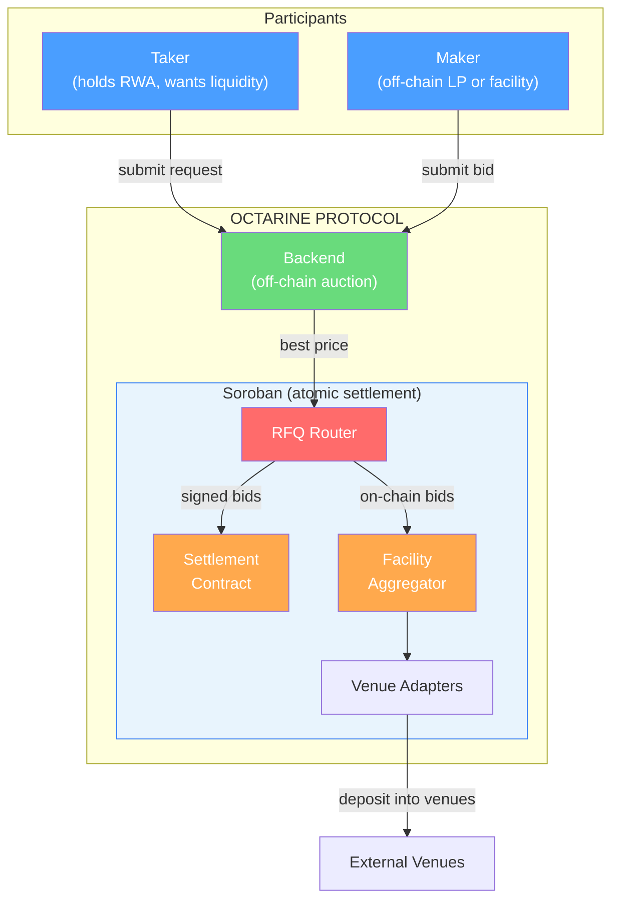
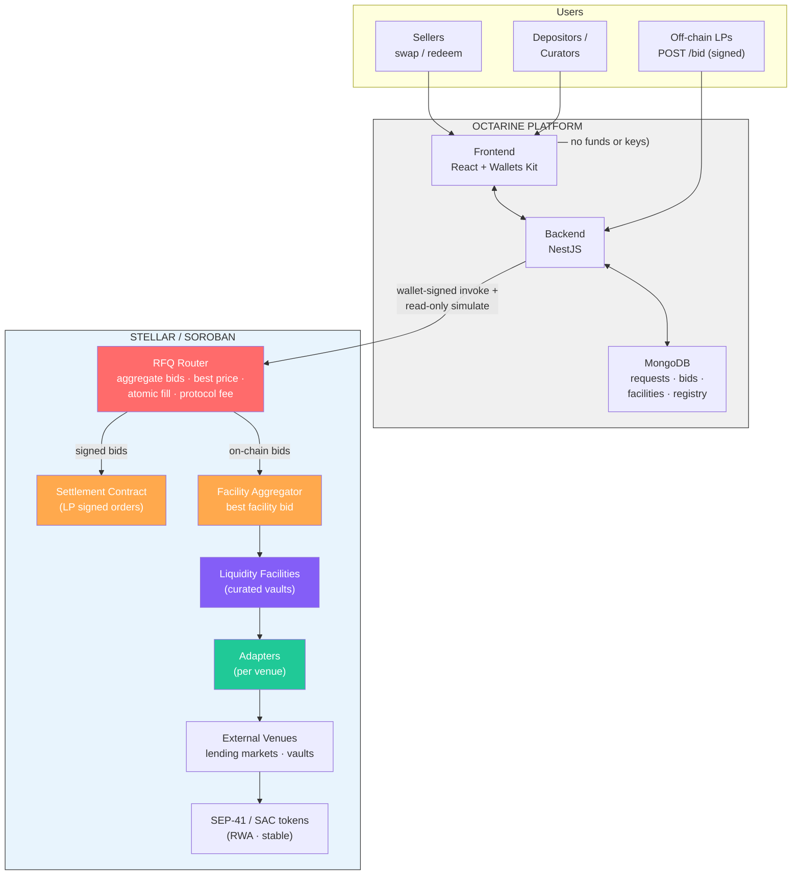
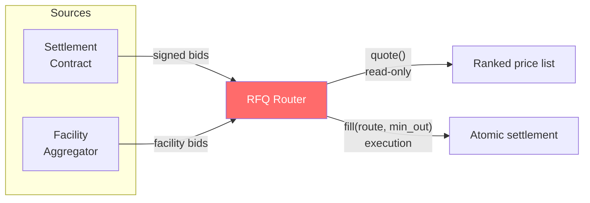
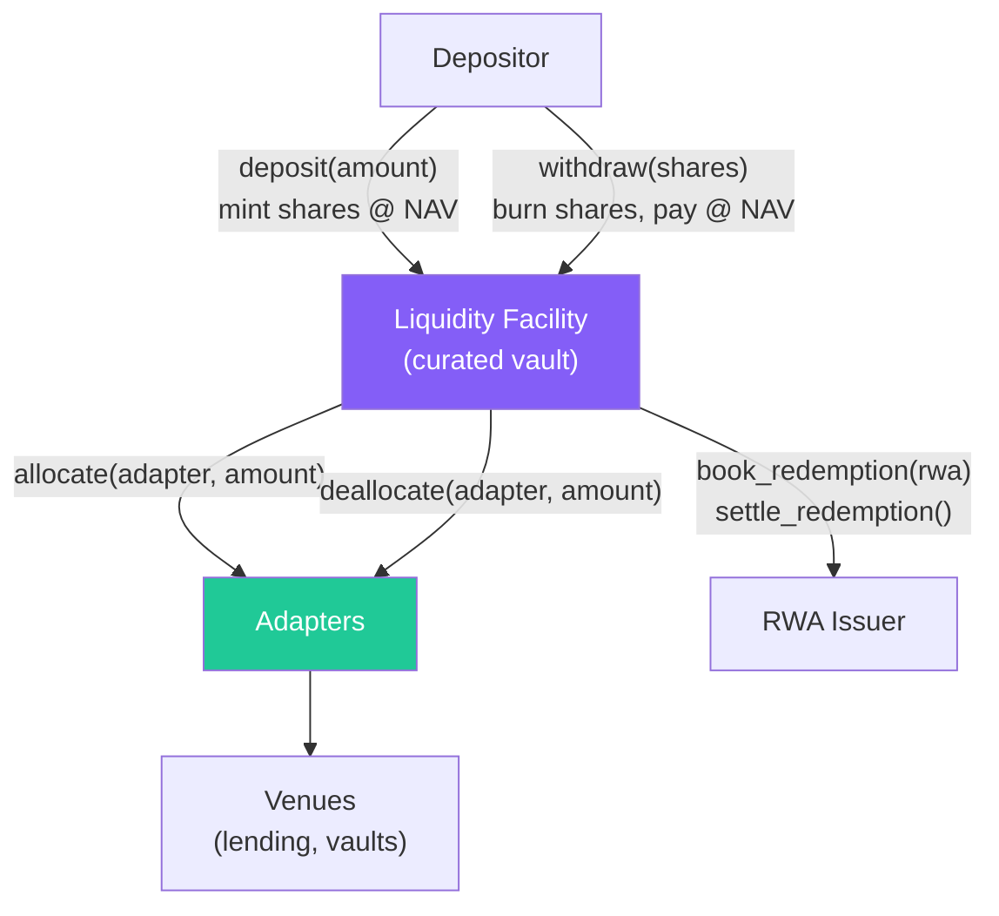
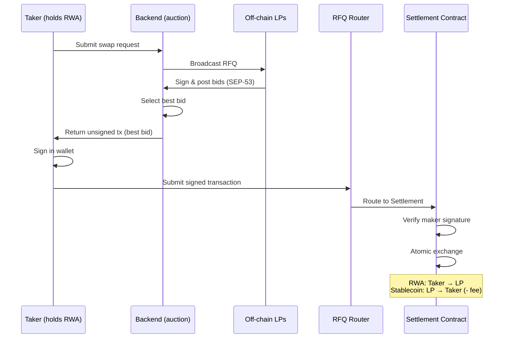
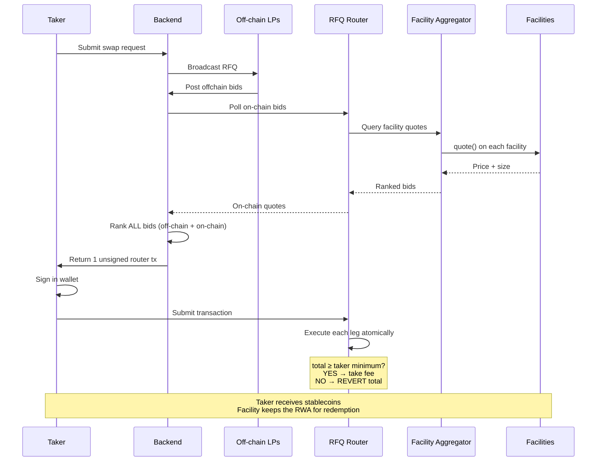
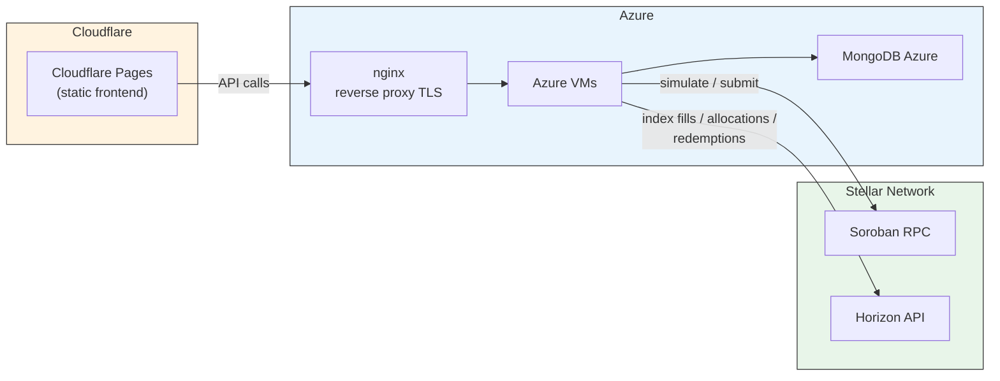
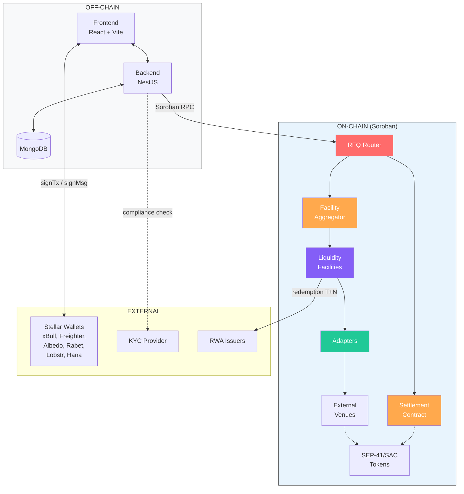

# Octarine Protocol — Technical Architecture

---

## 1. Introduction

### 1.1 High-Level Overview

Octarine is a protocol enabling **instant liquidity for RWAs** (Real World Assets) by auctioning them with institutional LPs and curated liquidity facilities.

**The problem**: RWAs struggle to get DEX liquidity because they're fragmented, regulated and have built-in redemption delays. These delays are not instant, which means:
- RWAs can't be used as collateral in lending (DeFi liquidations need instant liquidity)
- Users can't manage leverage loops (can't instantly unwind their positions)
- The absence of instant liquidity makes RWAs less attractive for prospective LPs, who can't afford to have their capital locked up unwillingly

**The Octarine solution**: Provide liquidity to RWAs via auctions with LPs and curated liquidity facilities. When there is a liquidation (on Octarine or on a connected venue), Octarine detects it and auctions it with connected bidders. The trade is awarded to the best bid. Bidders can create and manage vaults with their bidding strategy. These vaults keep user deposits in lending strategies and mobilize them when they win a liquidation.

The protocol comprises:

- A **settlement contract** — settles transactions between the auction winner and the user. Supports swaps and lending market liquidations.
- A **backend** — coordinates auction logic, aggregates off-chain and on-chain bids, selects the best price. Connected to an API/SDK for third parties.
- A **liquidity facility contract** — enables bidders to manage vaults keeping deposits in lending markets and bid with TVL.
- **Adapter contracts** — one per integrated protocol (e.g. each lending market connected to a facility has its own adapter).
- An **RFQ router contract** — considers off-chain and on-chain bids to find the best bid and settle the trade.
- A **facility aggregator contract** — aggregates prices from all liquidity facilities.

The settlement contract is deployed on Stellar Testnet at address `CAPVBMQBVQVDFDWFGH4M3EJH7CYM7MWIYE5TOYTYASOU26L2Q4T2YJZW`.

### 1.2 Key Terms

| Term | Definition |
|------|------------|
| **RFQ** | Request-for-Quote — auction mechanism to obtain the best price |
| **Taker** | RWA holder seeking instant liquidity |
| **Maker** | Off-chain LP or facility proposing a price |
| **PMM** | Private Market Maker |
| **Facility** | Curated, share-based vault holding deposits in yield strategies |
| **Curator** | Facility manager (pricing parameters, caps, venue whitelist) |
| **Venue** | External protocol (lending market, yield vault) |
| **Adapter** | Thin contract providing a uniform interface over a venue |
| **Haircut** | Discount applied to an RWA's price |
| **NAV/share** | Net Asset Value per facility share |
| **SEP-41** | Stellar token standard (uniform interface) |
| **SEP-53** | Stellar message signing standard |
| **SAC** | Stellar Asset Contract |
| **Soroban** | Stellar's smart contract platform |
| **Base assets** | Assets a facility deposits and pays out in (typically a stablecoin, e.g. USDC) |
| **Liquidation** | Forced sale of RWA collateral on a connected lending venue when a position becomes insolvent; primary source of RFQ flow |
| **strkey** | Stellar address encoding (`G…` for accounts, `C…` for contracts) |
| **Allowance** | Permission to spend a token up to an amount (with an `expiration_ledger`) |
| **Fee recipient** | Address receiving protocol fees |
| **XDR** | Stellar's canonical binary serialization (used for order hashing) |
| **Soroban RPC** | JSON-RPC endpoint for simulating and submitting Soroban transactions |

---

## 2. Architecture Overview

### 2.1 The Protocol at a Glance

Octarine conducts **off-chain auctions** with **on-chain atomic settlement**. Two liquidity sources compete:

1. **Off-chain LPs**: sign orders via `POST /bid` with SEP-53 signature
2. **Curated facilities**: quote live via the facility aggregator

The backend selects the **best price** across all sources and settles the winning route atomically on Soroban.

### 2.2 High-Level Diagram



### 2.3 Detailed System Architecture



### 2.4 Architecture Constraints

| # | Constraint | Description |
|---|-----------|-------------|
| 1 | **Non-custodial backend** | Every action is signed by wallet or authorized by contract. The backend holds no keys or funds. |
| 2 | **Atomic settlement** | All legs of a transaction execute in a single tx, or total revert. |
| 3 | **Best-price execution** | The router selects the best bid with a taker-specified minimum. |
| 4 | **Unified auction channel** | LP signed orders and facility bids are ranked together in a single channel. |
| 5 | **Wallet signatures (SEP-53)** | Compatible with browser wallets and bot wallets. |
| 6 | **Anti-replay security** | Bound to a specific deployment + network (SEP-53 passphrase). |
| 7 | **SEP-41 token model** | With explicit expiring allowances. |
| 8 | **Modular venue integration** | Via adapters with a fixed interface. Adding a new protocol = adding an adapter. |
| 9 | **Curated facilities** | Facilities act only within their curator-defined policy; they never take discretionary action outside it. |
| 10 | **Stellar-only deployment** | Testnet and mainnet only, via `stellar-cli`. |

---

## 3. Smart Contracts

> Typed Rust function signatures for all contracts are documented in section 7.

### 3.1 Settlement Contract

Soroban contract settling maker-signed orders between two SEP-41 tokens.

**Responsibilities**:
- SEP-53 signature verification
- Fund pull via SAC allowance
- Proportional fill calculation
- Atomic exchange via `transfer_from`
- Protocol fee collection

**Functions**:

| Function | Description |
|----------|-------------|
| `fill_rfq_order` | Validates maker order, verifies SEP-53 signature, executes atomic exchange |
| `fill_limit_order` | Same for limit orders |
| `fill_or_kill_*` | Variants requiring exact fill, otherwise revert |
| `register_order_signer` | Authorizes a delegated hot key to sign for the maker |
| `cancel_rfq_order` / `cancel_limit_order` | Cancels an individual order |
| `cancel_pair_*` | Invalidates all of a maker's orders for a pair below a salt |
| `initialize(admin)` | Contract initialization |
| `upgrade(wasm_hash)` | Contract upgrade |

**SAC Allowance** — Makers and takers must grant the contract a SEP-41/SAC allowance before it can pull funds; custody remains with the wallet, the backend holds no keys.

**Settlement math**:
- `taker_filled = min(fill, taker_amount − filled)`
- `maker_filled = floor(taker_filled × maker_amount / taker_amount)`
- `fee = floor(maker_filled × token_fee_amount / maker_amount)` (256-bit intermediates to avoid `i128` overflow)
- The taker receives `maker_filled - fee`

**Signature verification (SEP-53)** — The maker signs the order hash as a SEP-53 message; the contract recomputes `SHA256("Stellar Signed Message:\n" ‖ order_hash)` and verifies via `ed25519_verify`. A maker signing its own order needs no registration (its ed25519 key is recovered from its `G…` address); delegated hot keys are authorized via `register_order_signer`.

### 3.2 RFQ Router

Contract aggregating each bid source, selecting the best price, and settling the winning route atomically.



**Functions**:

| Function | Description |
|----------|-------------|
| `quote()` | Aggregates prices from each source, returns ranked list (read-only, polling) |
| `fill(route, min_out)` | Executes each route leg, verifies `min_out`, reverts on failure |
| `register_source(address)` | Whitelists a source (settlement or facility aggregator) |
| `initialize(admin, fee_recipient, fee)` | Initialization with fee parameters |
| `upgrade(wasm_hash)` | Contract upgrade |

A trade can settle against a single source or a **blend of multiple** (blended route). Atomicity is guaranteed: each leg settles in a single transaction; signed legs inherit the settlement contract's gating with the router as the authorized origin. A protocol fee is collected from the settled output.

### 3.3 Facility Aggregator

Contract collecting and ranking quotes from all curated facilities for a given RWA.

**Functions**:

| Function | Description |
|----------|-------------|
| `register_facility(curator, facility_address, supported_assets)` | Registers a facility with pause/revoke capability |
| `quote()` | Queries each facility for RWA price and size, returns ranked set |
| `fill(facility_address, amount)` | Forwards the fill request to the winning facility |

### 3.4 Liquidity Facility

Curated, share-based vault holding deposits in yield strategies, bidding on RFQs with its TVL.



**Functions**:

| Function | Description |
|----------|-------------|
| `deposit(amount)` | Mints shares at current NAV |
| `withdraw(shares)` | Burns shares, pays in stablecoins at NAV |
| `quote(rwa_amount)` | Returns the RWA buyback price within curator limits |
| `redeem_for_assets(amount)` | Called on win: validates price/caps, pulls stables from venues, pays seller, takes RWA |
| `allocate(venue_adapter, amount)` | Deploys idle stablecoins to whitelisted venues |
| `deallocate(venue_adapter, amount)` | Withdraws capital from venues |
| `book_redemption(rwa_amount)` | Records acquired RWA for issuer redemption |
| `settle_redemption()` | Settles the redemption (T+N), receives stablecoins from issuer |

**NAV & shares calculation**:
- `NAV = idle_base + venue_balances (incl. accrued yield) + acquired_RWA (at acquisition cost)`
- `share_price = NAV / shares`
- Withdrawals are served up to free liquidity; beyond that, they are queued until redemptions settle.

### 3.5 Adapters

Thin contracts giving each facility a uniform interface over an external venue.

**Functions**:

| Function | Description |
|----------|-------------|
| `deposit(amount)` | Transfers stablecoins from the facility to the venue |
| `withdraw(amount)` | Transfers from the venue to the facility |
| `total_assets()` | Facility balance in the venue (including accrued yield) |
| `max_withdraw()` | Instantly withdrawable amount |

**Planned adapters**: lending market and vault product. Adding a new protocol = adding a new adapter.

---

## 4. Protocol Flows

### 4.1 An Off-Chain LP Wins a Swap



### 4.2 A Curated Facility Wins (or Blended Route)



### 4.3 Facility Deposit and Withdrawal

**Deposit**: Depositor approves token + signs → Facility mints shares at current NAV/share → stablecoins deployed via Adapters to Venues (earn yield).

**Withdrawal**: Depositor signs withdrawal → Facility burns shares → pulls liquidity from Venues via Adapters if needed → pays stablecoins at current NAV.

### 4.4 RWA Redemption Lifecycle

1. The RFQ Router sends the RWA to the Facility (after winning the auction)
2. The Facility records the RWA via `book_redemption()`
3. The Facility redeems the asset with the issuer (T+N variable delay)
4. The issuer settles in stablecoins → facility NAV increases (minus curator fees) → share value rises

### 4.5 Lending Market Liquidation

1. A position becomes insolvent on a connected lending market
2. Octarine bots detect the unhealthy position
3. The backend triggers an RFQ auction for the liquidation
4. Bidders (LPs + facilities) submit their bids
5. The best bid wins → the Router sends stablecoins to the lending market (repays the loan)
6. The lending market releases the RWA collateral → transferred to the winner (LP or facility)

**Key utility**: RWAs become liquidatable in DeFi thanks to Octarine liquidity.

---

## 5. Technology Stack

### 5.1 Smart Contracts (Soroban)

| Contract | Role | Standards |
|----------|------|-----------|
| Settlement Contract | RFQ + limit orders, atomic exchange | SEP-53, SEP-41 |
| RFQ Router | Multi-source aggregation, atomic fill, fees | SEP-41 |
| Facility Aggregator | Facility ranking, routing | — |
| Liquidity Facility | Share-based vault, redemption, venue allocation | SEP-41 |
| Adapters | Uniform interface per venue | — |

**Language**: Rust (Soroban SDK)
**Deployment**: `stellar-cli` (deterministic build → optimize → deploy → initialize)
**Config**: Addresses in `deployments/<network>.json`

### 5.2 Backend

| Component | Technology |
|-----------|------------|
| Framework | NestJS (TypeScript) |
| Database | MongoDB |
| Roles | Auction coordination, bid intake, on-chain quote aggregation, keyless Soroban operation assembly, keepers |
| Stored data | Requests, bids, approvals, facilities, registry |
| API | API/SDK for LP bots, third-party integrators, curator console |
| Blockchain reads | Soroban RPC — order hashes, info, signers, token balances. Horizon API — event indexing |

### 5.3 Frontend

| Component | Technology |
|-----------|------------|
| Framework | React + Vite (TypeScript) |
| Wallets | Stellar Wallets Kit: xBull, Freighter, Albedo, Rabet, Lobstr, Hana |
| Features | Swap/redeem, auction/bid boards, LP bid flows, facility deposit/withdraw, curator console, dashboards |
| Signatures | `signTransaction` (fills/router) and `signMessage` SEP-53 (maker orders) |

### 5.4 Infrastructure



**Contract deployment pipeline**:
1. `stellar-cli contract build` (deterministic build)
2. `stellar-cli contract optimize` (WASM optimization)
3. `stellar-cli contract deploy` (on-chain deployment)
4. `stellar-cli contract invoke -- initialize(...)` (initialization with addresses)
5. Addresses saved in `deployments/<network>.json`

---

## 6. Integrations

| Integration | Usage |
|-------------|-------|
| **Stellar Wallets Kit** | Wallet connection + `signTransaction` + `signMessage` |
| **Soroban RPC / Horizon** | Simulation, submission, ledger queries |
| **SEP-41 / SAC tokens** | Uniform interface for RWAs and stablecoins |
| **Lending markets** | Yield venues (via adapters) |
| **Vault products** | Yield venues (via adapters) |
| **KYC/Compliance provider** | Regulated asset gating, identity verification |

---

## 7. Typed Rust Function Signatures

### 7.1 Settlement Contract

```rust
#[contractimpl]
impl SettlementContract {
    pub fn __constructor(e: Env, admin: Address);
    
    pub fn fill_rfq_order(
        e: Env,
        taker: Address,
        order: RfqOrder,
        signature: BytesN<64>,
        fill_amount: i128,
    ) -> FillResult;

    pub fn fill_limit_order(
        e: Env,
        taker: Address,
        order: LimitOrder,
        signature: BytesN<64>,
        fill_amount: i128,
    ) -> FillResult;

    pub fn fill_or_kill_rfq(
        e: Env,
        taker: Address,
        order: RfqOrder,
        signature: BytesN<64>,
    ) -> FillResult;

    pub fn register_order_signer(
        e: Env,
        maker: Address,
        signer: Address,
    );

    pub fn cancel_rfq_order(e: Env, maker: Address, order_hash: BytesN<32>);
    pub fn cancel_limit_order(e: Env, maker: Address, order_hash: BytesN<32>);
    pub fn cancel_pair_orders(
        e: Env,
        maker: Address,
        taker_token: Address,
        maker_token: Address,
        min_salt: u128,
    );

    pub fn initialize(e: Env, admin: Address);
    pub fn upgrade(e: Env, new_wasm_hash: BytesN<32>);
}
```

### 7.2 RFQ Router

```rust
#[contractimpl]
impl RfqRouter {
    pub fn quote(
        e: Env,
        taker_token: Address,
        maker_token: Address,
        amount: i128,
    ) -> Vec<QuotedSource>;

    pub fn fill(
        e: Env,
        taker: Address,
        route: Vec<RouteLeg>,
        min_out: i128,
    ) -> i128;

    pub fn register_source(e: Env, source: Address);
    pub fn initialize(e: Env, admin: Address, fee_recipient: Address, fee_bps: u32);
    pub fn upgrade(e: Env, new_wasm_hash: BytesN<32>);
}
```

### 7.3 Facility Aggregator

```rust
#[contractimpl]
impl FacilityAggregator {
    pub fn register_facility(
        e: Env,
        curator: Address,
        facility: Address,
        supported_assets: Vec<Address>,
    );

    pub fn pause_facility(e: Env, facility: Address);
    pub fn revoke_facility(e: Env, facility: Address);

    pub fn quote(
        e: Env,
        rwa_token: Address,
        amount: i128,
    ) -> Vec<FacilityQuote>;

    pub fn fill(
        e: Env,
        facility: Address,
        rwa_token: Address,
        amount: i128,
    ) -> i128;
}
```

### 7.4 Liquidity Facility

```rust
#[contractimpl]
impl LiquidityFacility {
    pub fn deposit(e: Env, depositor: Address, amount: i128) -> i128;  // returns shares
    pub fn withdraw(e: Env, depositor: Address, shares: i128) -> i128;  // returns assets

    pub fn quote(e: Env, rwa_token: Address, rwa_amount: i128) -> i128;  // returns stablecoin price

    pub fn redeem_for_assets(
        e: Env,
        rwa_token: Address,
        rwa_amount: i128,
        seller: Address,
    ) -> i128;

    pub fn allocate(e: Env, adapter: Address, amount: i128);
    pub fn deallocate(e: Env, adapter: Address, amount: i128);

    pub fn book_redemption(e: Env, rwa_token: Address, rwa_amount: i128);
    pub fn settle_redemption(e: Env, rwa_token: Address) -> i128;
}
```

### 7.5 Adapter (trait)

```rust
pub trait VenueAdapter {
    fn deposit(e: Env, amount: i128) -> i128;
    fn withdraw(e: Env, amount: i128) -> i128;
    fn total_assets(e: Env) -> i128;
    fn max_withdraw(e: Env) -> i128;
}
```

---

## 8. Soroban Storage Layout

Each contract uses the three Soroban storage types based on data lifetime and cost.

### 8.1 Settlement Contract

| Type | Key | Data | Rationale |
|------|-----|------|-----------|
| **Instance** | `Admin` | `Address` | Contract config, lives as long as the contract |
| **Instance** | `FeeRecipient` | `Address` | Same |
| **Instance** | `FeeBps` | `u32` | Same |
| **Persistent** | `OrderFill(BytesN<32>)` | `i128` | Filled amount per order hash — must survive to prevent double-fill |
| **Persistent** | `OrderSigners(Address)` | `Vec<Address>` | Delegated hot keys — must persist for security |
| **Persistent** | `CancelledSalt(Address, Address, Address)` | `u128` | Anti-replay nonces — must persist to prevent reuse |

### 8.2 RFQ Router

| Type | Key | Data | Rationale |
|------|-----|------|-----------|
| **Instance** | `Admin` | `Address` | Config |
| **Instance** | `FeeRecipient` | `Address` | Config |
| **Instance** | `FeeBps` | `u32` | Config |
| **Instance** | `Sources` | `Vec<Address>` | Whitelisted sources registry — small list, changes rarely |

### 8.3 Facility Aggregator

| Type | Key | Data | Rationale |
|------|-----|------|-----------|
| **Instance** | `Admin` | `Address` | Config |
| **Persistent** | `Facility(Address)` | `FacilityRecord` | Facility registry — must persist even if the aggregator is upgraded |

### 8.4 Liquidity Facility

| Type | Key | Data | Rationale |
|------|-----|------|-----------|
| **Instance** | `Curator` | `Address` | Config |
| **Instance** | `BaseAsset` | `Address` | Facility stablecoin |
| **Instance** | `TotalShares` | `i128` | Share counter — frequently accessed |
| **Persistent** | `ShareBalance(Address)` | `i128` | Per-depositor share balance — critical, must never disappear |
| **Persistent** | `Redemption(BytesN<32>)` | `RedemptionRecord` | Pending redemptions (T+N) — must persist until settlement |
| **Persistent** | `VenueAlloc(Address)` | `i128` | Capital allocated per adapter — critical for NAV calculation |
| **Temporary** | `LastQuote(Address)` | `QuoteCache` | Last quote cache — expires naturally, not critical |

### 8.5 Adapter

| Type | Key | Data | Rationale |
|------|-----|------|-----------|
| **Instance** | `Facility` | `Address` | Owning facility |
| **Instance** | `Venue` | `Address` | External venue address |

### TTL & Keepers

Persistent and Instance entries can be archived if their TTL expires. A keeper bot extends TTLs for critical entries (order fills, share balances, redemptions) periodically or via a cron schedule. Temporary entries expire naturally and require no extension.

> *Since Protocol 23 (CAP-0066), archived entries are automatically restored if they appear in the footprint of an `InvokeHostFunctionOp` transaction.*

---

## 9. RWA Pricing Mechanism

### 9.1 Competing Price Sources

The final price received by an RWA seller depends on competition between the liquidity sources:

| Source | How it prices | Basis |
|--------|--------------|-------|
| **Off-chain LP** | Sets its own price freely | Own analysis + market + margin |
| **Curated facility** | `NAV issuer × (1 - haircut curator)` | Issuer-published NAV + curator strategy |

```
Final price = MAX(LP bid, facility bid)
              subject to ≥ seller's min_out
```

### 9.2 Issuer NAV

The RWA issuer regularly publishes the **Net Asset Value** (NAV) of its token. This value serves as:

1. **Reference for facilities**: the curator uses NAV to calculate its quote price
2. **Anti-manipulation guardrail**: the taker knows the reference value and sets `min_out` accordingly
3. **Accounting basis**: RWAs held by a facility pending redemption are booked at issuer NAV in the facility's NAV calculation

### 9.3 Facility Quote Calculation

```
quote_price = nav_issuer × (1 - haircut_bps / 10000)
```

The **haircut** is the curator's margin to compensate for:
- Redemption delay risk (T+N)
- Opportunity cost of mobilized capital
- Issuer default risk

The haircut is bounded by **curator caps** defined at facility registration.

### 9.4 Protections

| Protection | Mechanism |
|-----------|-----------|
| **Staleness check** | If issuer NAV hasn't been updated for more than X hours, the facility stops quoting |
| **Taker `min_out`** | Seller sets minimum acceptable output — automatic revert if not met |
| **Curator caps** | Maximum haircut bounded — prevents abusive pricing |
| **Competition** | Off-chain LPs create competitive pressure on facility pricing |

### 9.5 Issuer Default

If the issuer fails to settle the redemption within the T+N window:

1. The RWA is marked as a **loss** in the facility
2. The facility's NAV is **adjusted downward** (RWA removed from assets at acquisition cost)
3. Share value **decreases** proportionally
4. Depositors absorb the loss (inherent risk of the curated facility)
5. Governance can **revoke** the issuer from supported assets

---

## 10. Soroban Events

Every significant action emits an event on-chain for indexing, auditability, and integrability.

### 10.1 Settlement Contract

```rust
// Order filled (swap executed)
Event::Fill {
    order_hash: BytesN<32>,
    taker: Address,
    maker: Address,
    taker_token: Address,
    maker_token: Address,
    taker_amount: i128,
    maker_amount: i128,
    fee: i128,
}

// Order cancelled
Event::Cancel {
    maker: Address,
    order_hash: BytesN<32>,
}

// Hot key registered/revoked
Event::SignerUpdated {
    maker: Address,
    signer: Address,
    authorized: bool,
}
```

### 10.2 RFQ Router

```rust
// Route executed
Event::RouteFilled {
    taker: Address,
    taker_token: Address,
    maker_token: Address,
    total_in: i128,
    total_out: i128,
    fee: i128,
}
```

### 10.3 Facility Aggregator

```rust
// Facility registered/modified
Event::FacilityRegistered {
    curator: Address,
    facility: Address,
    supported_assets: Vec<Address>,
}

Event::FacilityPaused { facility: Address }
Event::FacilityRevoked { facility: Address }
```

### 10.4 Liquidity Facility

```rust
// Deposit
Event::Deposit {
    depositor: Address,
    assets: i128,
    shares_minted: i128,
    nav_per_share: i128,
}

// Withdrawal
Event::Withdraw {
    depositor: Address,
    shares_burned: i128,
    assets_returned: i128,
    nav_per_share: i128,
}

// RWA acquired via auction
Event::RwaAcquired {
    rwa_token: Address,
    rwa_amount: i128,
    stables_paid: i128,
}

// Redemption settled
Event::RedemptionSettled {
    rwa_token: Address,
    stables_received: i128,
}

// Venue allocation/deallocation
Event::VenueAllocation {
    adapter: Address,
    amount: i128,
    direction: Symbol,  // "allocate" or "deallocate"
}
```

---

## 11. Keepers (Off-Chain Bots)

### 11.1 Keeper Roles

| Keeper | Trigger | Action | Frequency |
|--------|---------|--------|-----------|
| **Liquidation detector** | Health factor < threshold on connected lending market | Triggers an RFQ auction for the liquidation | Every ledger (~5s) |
| **TTL extender** | Persistent/Instance entry TTL approaching expiration | Submits `ExtendFootprintTTLOp` for critical entries | ~Every 24h |
| **Indexer** | New events emitted by contracts | Writes fills, allocations, redemptions to MongoDB | Real-time (stream) |
| **NAV monitor** | Issuer NAV updated or staleness detected | Updates facility quotes or disables them | Periodic (~1h) |

### 11.2 Infrastructure

- **Runtime**: Node.js (TypeScript), packaged in Docker
- **Deployment**: Azure VMs, same infra as the NestJS backend
- **Monitoring**: Alerts if a keeper fails or falls behind
- **Dedicated wallet**: Each keeper has a Stellar wallet funded with XLM for transaction fees (gas)
- **Fallback**: If the liquidation detector is down, positions are not liquidated via Octarine but remain liquidatable by other lending market actors

### 11.3 Operational Cost

Keeper transactions are lightweight operations:
- `ExtendFootprintTTLOp`: ~100 stroops per entry
- Soroban reads for liquidation detection: free (read-only simulation)
- Liquidation submission (RFQ): standard Soroban fees

---

## 12. STRIDE Threat Model

| Threat | Type | Scenario | Mitigation |
|--------|------|----------|------------|
| **Identity spoofing** | S — Spoofing | Fake LP bid with stolen signature or compromised hot key | SEP-53 signatures bound to specific deployment + network (passphrase). Hot keys registered via `register_order_signer`, revocable by maker. |
| **Price manipulation** | T — Tampering | Facility manipulates its quote price to extract value | Taker-specified `min_out` with revert if total < minimum. Read-only `quote()` separated from `fill()`. Curator caps on haircut. |
| **Trade denial** | R — Repudiation | LP denies having submitted a bid after unfavorable trade | SEP-53 signature verifiable on-chain. `Fill` events logging order hash, amounts, and addresses permanently. |
| **Information leak** | I — Info Disclosure | Observing quotes to copy a curator's pricing strategy | On-chain quotes are public by design (transparency). LP bids encrypted in transit (TLS). Backend is keyless with no sensitive data. |
| **Service disruption** | D — Denial of Service | Flood of fake RFQ requests saturating the backend | API rate limiting, Soroban gas limits, nginx throttling. `quote()` functions are read-only (no state change). No public mempool on Stellar. |
| **Privilege escalation** | E — Elevation of Privilege | Malicious adapter draining facility funds | Adapter whitelisted per curator, fixed interface (4 functions). Governance pause/revoke on aggregator. Upgrades via controlled `wasm_hash`. |

### Stellar Protocol-Level Protections

| Protection | Mechanism |
|-----------|-----------|
| **Anti-MEV** | No public mempool. Application order randomized each ledger. ~5s finality. |
| **Anti-reentrancy** | Classic reentrancy is not possible on Soroban by design. |
| **Anti-replay** | SEP-53 signatures bound to deployment (domain separation) and network (passphrase). `cancelled_salt` nonces in Persistent storage. |
| **Fund isolation** | Non-custodial backend. Every transfer goes through `transfer_from` with explicit, expiring allowances (SEP-41). |

---

## 13. Component Summary



